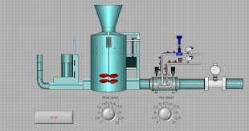
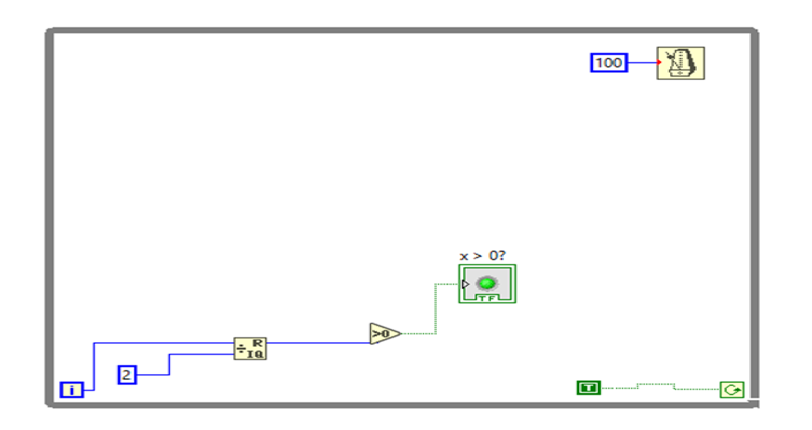
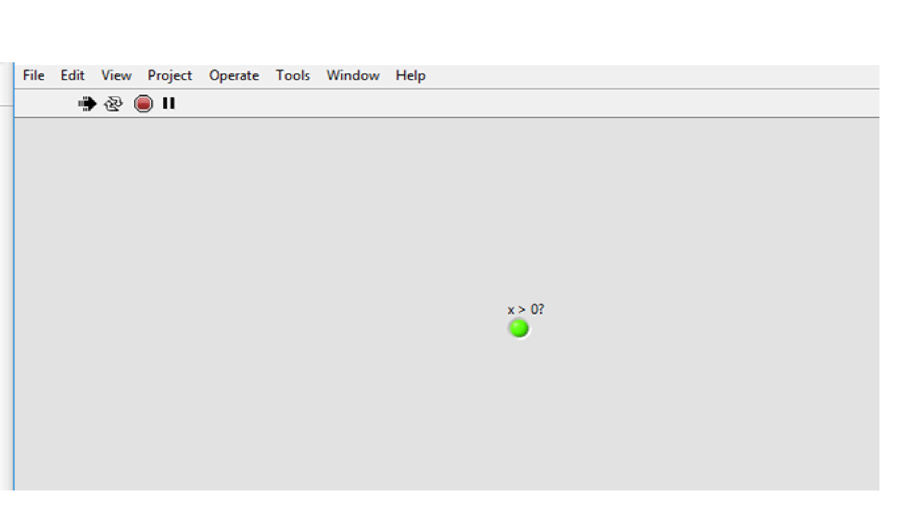
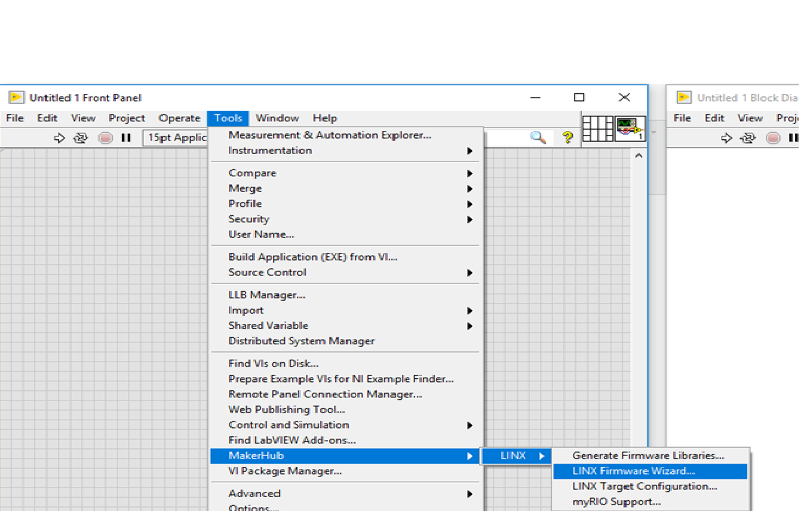
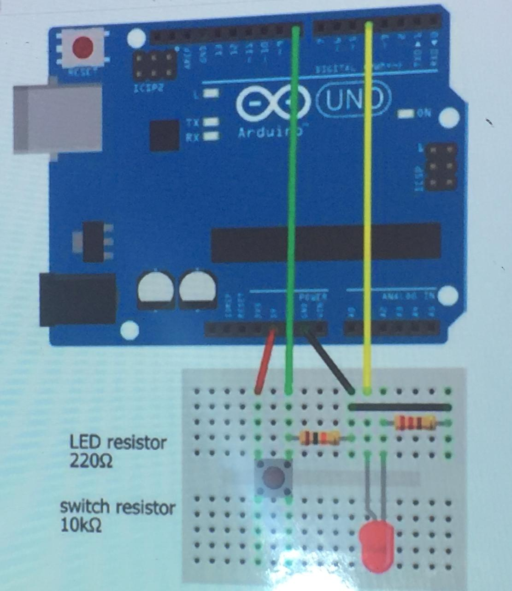
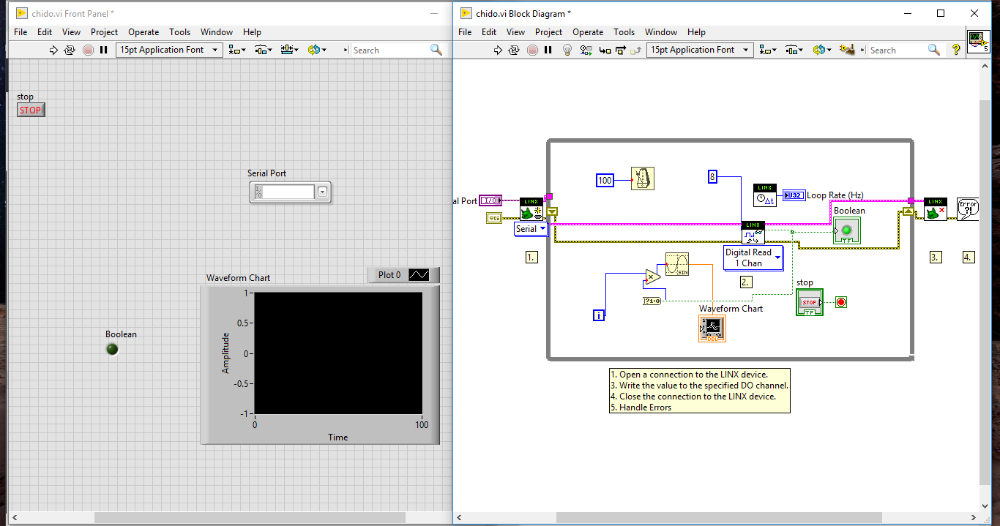
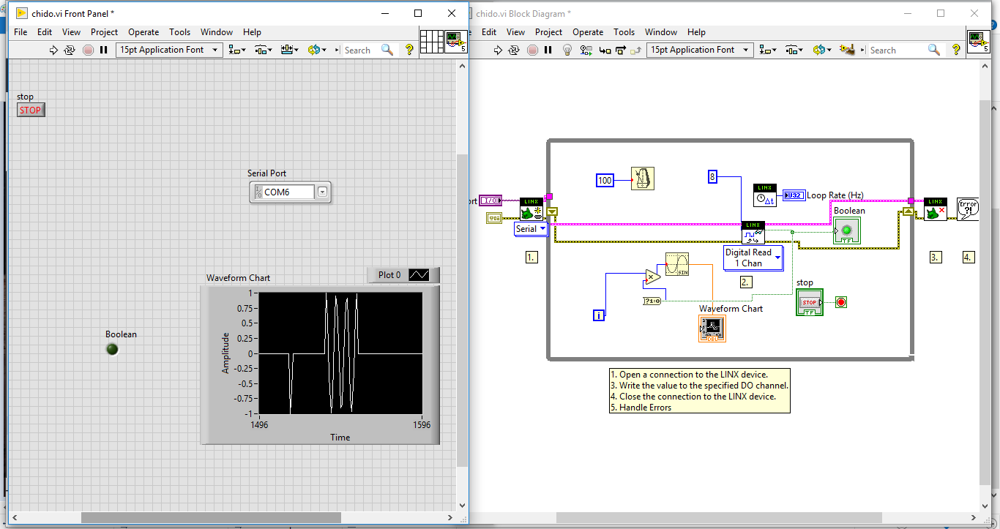
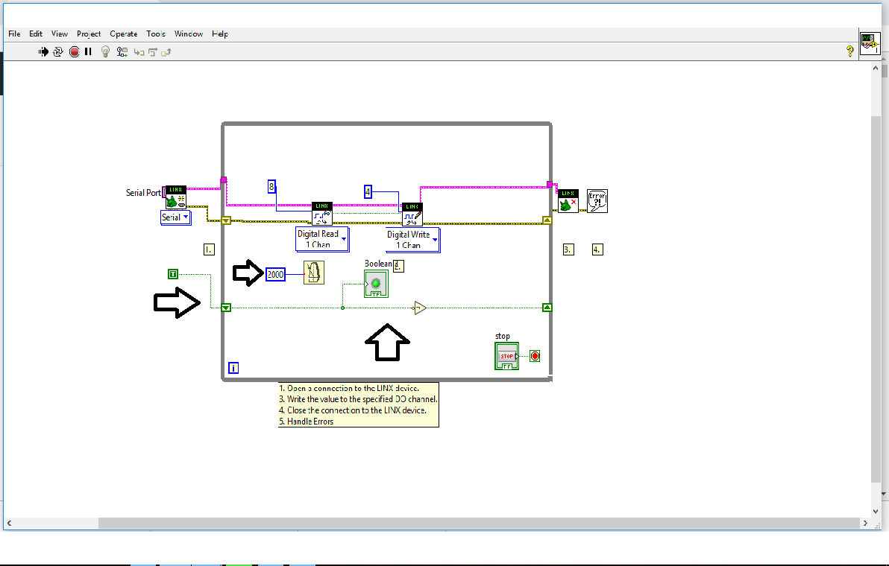
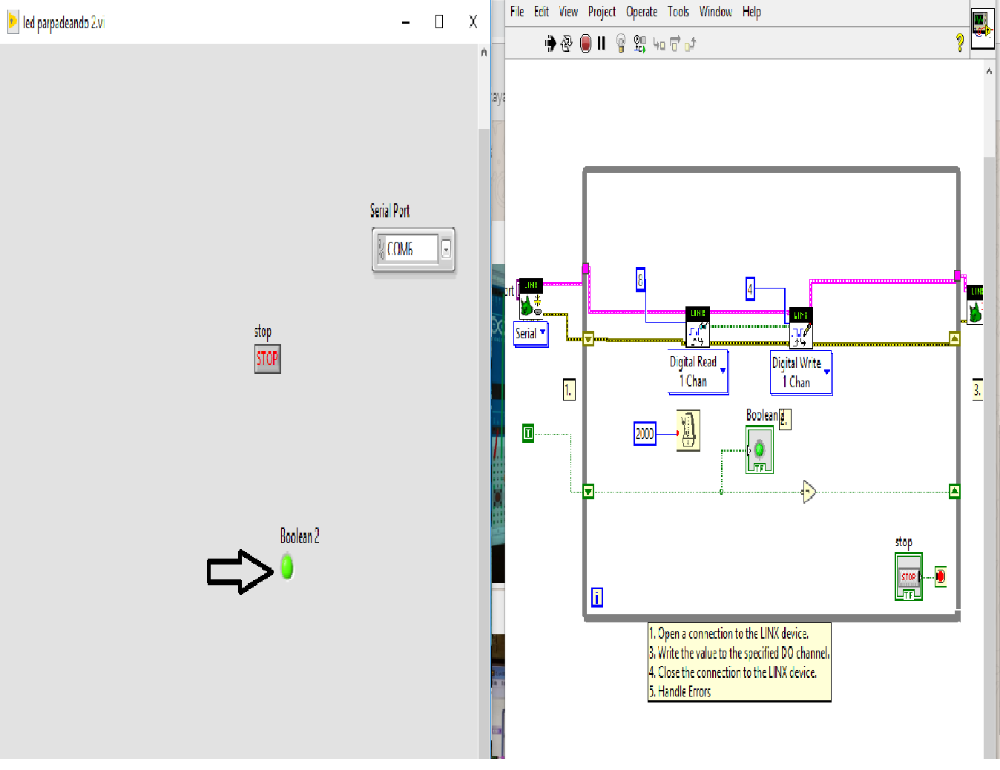
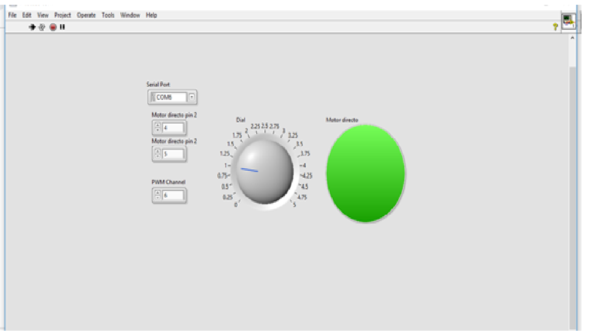

# Ingenieria
# Tecnologico de Estudios Superiores de Huixquilucan 
### Ingenieria Mecatronica 
### Asignatura. Control de procesos 
### Asesor. Dr Enrique Garcia Trinidad 
### Alumno. Brayan Adrian Navarrete Maltos

# Control de procesos 

# Introduccion al LabVIEW 
LabVIEW es un entorno de programacion grafica usado por ingenieros y cientificos para desarrollar mediciones sofisticadas, pruebas y sistemas de control. LabVIEW puede integrar una gran variedad de dispositivos de harware. En este curso utilizaremos el hardware de comunicacion serial y el DOQ(Data adquisition) configurando el hardware en el MAX(Measurement Automation Explorer).
Usted puede descargar la version de labVIEW estudiantil para windows MAC por lo que no necesita comprar el software.
LabVIEW es la contraccion de las palabras Laboratory Virtual Instrument.
LabVIEW es un software de desarrollo grafica y flexible creado por national instrument, una compañia que crea productos de hardware y software que le permiten a las computadoras a ayudar a ingenieros y cientificos a tomar mediciones, controlar procesos, analizar y guardar datos.
National instrument fue fundada hace 39 años en Texas apartir de personas que laboraban en la universidad de Texas.
Cientificos e ingenieros en investigacion, desarrollo, produccion, pruebas e industrias de servicio como los semiconductores automotrices, aeroespacial, electronica, quimica, comunicaciones y farmaceutica han usado y continuan usando labview para desarrollar su trabajo como por ejemplo Spacex utiliza LabVIEW para llevar los coetes falcon 9 al espacio  
### Instrumentos virtuales 
Los programas de LabVIEW son llamados instrumentos virtuales o VI(virtual instrument ) labVIEW es diferente de otros lenguajes de programacion como por ejemplo Python o "C" ya que labVIEW utiliza un lenguaje de programacion grafica conocida como lenguaje de programacion "G" para crear programas basados en simbolos graficos. LabVIEW utiliza una terminologia familiar para cientificos e ingenieros, por lo que sus simbolos o iconos graficos son facilmente identificables por inspeccion visual se puede aprender labVIEW incluso si se tiene poca experiencia en la programacion.
# Contenido
### Programas en Labview
### Programa No.1
Para poder iniciar con la programacion en LabVIEW y comenzar con nuestro primer programa es necesario ir explicando paso a paso los procedimientos a seguir como se muestra a continuacion.

1.- Ejecutando por primera vez LabView aparecerá un recuadro como se muestra en la siguiente imagen de Welcome to LabVIEW el cual cancelaremos presionando (x) en la parte superior derecha.

2.- Posteriormente crearemos una nueva plataforma de trabajo, dándole clic en file –New VI- como se muestra en la siguiente imagen en la parte superior izquierda.

3.- Al crear un nuevo proyecto podrás ver que existen dos plataformas de trabajo las cuales no están en orden como se muestra en la siguiente imagen.

4.- Para que podamos trabajar al mismo tiempo en las dos plataformas, presionando con las teclas ctrl+T se dividirá mita y mitad como se muestra en siguiente imagen y ya estaremos listos para comenzar a trabajar.

5.- El objetivo de nuestro primer programa es restar dos numeros dentro de un ciclo while.
Primero hay que identificar como se llaman las plataformas de trabajo, como ya lo hemos notado en la imagen anterior existen dos, la primera que está situado a lado izquierdo es el panel frontal (Front Panel) y la segunda situado a lado derecho llamado Diagrama de bloques (Block Diagram).
En el panel frontal al darle clic derecho sobre la plataforma nos parecerá un recuadro llamado controls el cual contiene diversas herramientas con las cuales se puede trabajar, note que en la parte superior izquierda hay una tachuela la cual si le damos clic sobre ella nos sirve para tener el cuadro abierto y no se cierra mientras se esté trabajando sobre la plataforma este ejemplo se muestra en la siguiente imagen señalado con una flecha azul. 

6.-Para seguir con el trabajo seleccionamos en el cuadro de -controls- en la opción de numeric debemos seleccionar las opciones de numeric y la arrastramos dos veces a la plataforma de Front Panel al igual que la opcion de numeric indicator la opcion de numeric indicador se le puede cambiar el nombre dandole click dos veces en este ejemplo lo llamaremos Valor A y la otra opcion la llamaremos Valor B y el numeric indicador lo llamaremos Resultado cabe mencionar que en la plataforma de Front Panel tenemos que tener un boton de stop para parar el ciclo while ya que sin este el programa no funcionaria, para tener obtener este boton debemos de ubicarnos en la opcion de Boolean ya seleccionado esta opcion buscaremos la opcion que dice Stop Botton y la arrastraremos a la plataforma Front Panel como se muestra en la siguiente imagen. 

7.- Como ya vimos en imagen anterior los objetos que arrastramos en la plataforma de Front Panel aparecen tambien en la plataforma de Block Diagram, el siguiente paso es ubicarnos en la plataforma de Block Diagram y seleccionar la opcion de Numeric ya seleccionado esta opcion nos aparece una ventanilla en la cual vamos a seleccionar la opcion de subtract al igual que un ciclo while para esto seleccionamos la opcion de Structures ya seleccionado esta opcion nos mostrara otra opcion llamada While loop la cual arrastraremos hacia la plataforma de Block Diagram encerrando todas las opciones que estan en dicha plataforma procedemos a unir dichas opciones como se muestra en la siguiente imagen.  

8.- Para poder ver que el programa funciona correctamente es necesario correr el programa con las herramientas que están en la barra de herramientas, la barra de la flecha es para correr el programa  como se muestra en la siguiente imagen. 

### Programa No.2

1.- Para este programa seguiremos los primeros 5 pasos del primer programa, ya que hemos hecho lo anterior seleccionamos la opción de Numeric para que nos aparezca la opción de numeric control la cual vamos arrastrar 3 veces en la plataforma de Front Panel esto con el fin de llamarlo cada uno como peso, altura y el porcentaje.
Ya echo lo anterior necesitaremos un Vertical Fill Slide esta opcion la encontramos dentro de la opcion de Numeric y la arrastraremos a la plataforma de Front Panel esta opcion no sirve para darle los rangos de de obesidad, sobrepeso y peso normal lo podemos diseñar como se muestra en  siguiente imagen.
Por ultimo debemos de arrastrar un boton Stop esta opcion ya se a explicado con anterioridad como encontrarlo seleccionarlo y arrastrarlo.

2.- Ahora nos ubicaremos en la otra plataforma de block diagram en la cual seleccionamos la opcion de Structures para seleccionar el ciclo While Loop y dentro de este ciclo arrastramos las siguientes opciones primeramente seleccionamos la opcion de numeric y dentro de esta opcion arrastraremos la opcion de constant, ya echo lo anterior anadiremos las operaciones estas las encontramos en la opcion de numeric y dentro de esta arrastraos las opciones de Divide, Add, Square esta ultima la arrastraremos 2 veces y en la opcion de Boolean arrastraremos la opcion not ya que con esta negaremos la union de estas opciones se muestra en la siguiente imagen.

3,- Corremos el programa dando click en a flecha ubicada en la parte de arriva y como podemos ver tenemos que meter valores en la opcion de numeric control, en las opciones de Peso, Altura, como se mostra en la imagen a continuacion existen dos variabloes que estan en centimetros y metros podemos utilizar cualquiera de estas dos opciones solo hay que tener cuidado con el punto decimal.
Haremos un ejemplo con un peso de 90kg y una altura de 1.75m el resultado se vera reflejado en el Vertical Fill Slide como se muestra en la siguiente imagen. 

### Programa No.3 (Parpadeo de un led)

1.- Para poder visualizar el parpadeo de un led en LabVIEW, hacemos los primeros 5 pasos que hicimos en el primer programa ya echo esto no situaremos en la plataforma de Block Diagram para seleccionar los siguiente elementos un Greater Than 0? ubicado dentro de la opcion de Coparison, despues otro elemento con el cual vamos a trabajar es el Quotient y remainder ubicado en la misma opcion de Comparison, Despues vamos a encerrar todos esto elementos en un ciclo loop ubicado dentro de la opcion de Structures, para poder unir todos estos elementos tenemos que ubicarnos en la plataforma de Front Panel para seleccionar la opcion de Round LED al hacer esto nos aparecera en la plataforma de diagram block otro elemento, para poder hacer que el led aprenda y apague debemos de agregar un Wait Until Next ms Multiple que esta dentro de la opcion Timming a esta opcion debemos de añadirle una constante ya que esta va a indicar el perido en el cual se va aprender y apagar para esto debemos de seleccionar la opcion Numeric Constant que esta adentro de la opcion Numeric a esta opcion le daremos una constante de 500. Para finalizar debemos de seleccionar la opcion de True Constant en la opcion de Boolean en la plataforma de Block Diagram en la siguiente imagen se muestra como debe de ir conectados todos los elementos de la plataforma de Diagram Block. 

2.- Al correr el programa podermos ver en la plataforma de front Panel el led prende y apaga. Si modificamos la contante de 500 por un numero menor podemos ver que este pre y apaga mas rapido. 

### Programa No.4 (Parpadeo de un led. Interfaz de LabVIEW y ARDUINO)

1.- Para poder hacer la interfaz entre el LabVIEW y ARDUINO es necesario descargar unas librerias la de toolkits linx y visa en este link se explica como hacer dicha interfaz https://www.youtube.com/watch?v=p5qlwufUeEM.
Ya que tengamos instaladas la librerias hacemos los primeros 5 pasos del primer ejercicio para despues ubicarnos en la opcion de Tools, ya desplejada esta opcion nos va aparecer varias opciones la que nosotros seleccionaremos se llama MarkerHub la cual nos va a desplazar la opcion de LINX, seguido de posicionarnos en esta tendremos la opcion de linx Firmware Wizard, en la siguiente imagen se ven los pasos ya mencionados. 

2.- Ya seleccionada la opcion de linx Firmware Wizard seleccionaremos el tipo de arduino que utilizaremos, en mi caso estoy utilizando el arduino uno.   

3.- Ya seleccionado el arduino le damos en siguiente y nos abrira la siguiente ventana en la cual comunicaremos el puerto serial de donde se comunicara la computadora con el arduino en este caso esta conectado al com 6. 

4.- Ya vinculado con el Com 6 le damos siguiente a todo lo que nos aparesca asta que nos aparesca cargando como se muestra en la siguiente imagen. 

5.- Ya que se haya cargado nos aparecera otra pestaña en la cual daremos click en la opcion de Launch Exaple. 

6.- Al darle click a la opcion anterior nos mostrara la pantalla principal la cual ya podremos trabajar haciedo la interfaz entre LabVIEW y arduino 

7.- Para corroborar que nuestro arduino esta bien conectado con la interfaz del LabView hacemos una pequeña prueba conectando una resistencia seguida de un led y directo a tierra. como se muestra en la siguiente imagen, ya conectado la electronica corremos el programa y damos click sobre el led que se muestra en la plataforma de Front Panel y podemos ver que el led va a prender.              

8.- Ya que hemos visto como hacer la interfaz del arduino con LabVIEW modificamos el codigo para que el led prenda y apage en pequeños periodos de tiempo, para ello modificamos el tercer programa y lo añadimos a la plataforma que ya habiamos mencionado en los pasos  de tal manera que las conecciones queden tal y como esta en la siguiente imagen.   

9.- Al correr el programa veremos como relacionando el tercer programa con l interfaz de arduino podemos llevarlo a la parte fisica con el led.     

### Programa No.5 (Control de temperatura)

1.- Para poder iniciar con la programacion de este ejercicio en necesario repetir los primeros 5 pasos del primer programa, ya echo esto nos ubicamos en la plataforma de Front Panel para seleccionar los siguiente elemento un Numeric control y un Thermometer ubicados dentro de la opcion de Numeric, despues seleccionamos un Stop Booton y un Round Led dentro de la opcion de Boolean en la siguiente imagen se ven los elementos graficos en la plataforma Front Panel.   

2.- Despues de verificar los anterior con el sistema grafico, nos ubicamos en la plataforma de Diagram Block y seleccionamos los siguiente elementos, debemos de agregar un Wait Until Next ms Multiple que esta dentro de la opcion Timming a esta opcion debemos de añadirle una contante, tambien necesitaremos la opcion Multiply dentro de la opcion Numeric, despues un Greater or Qual ubicado dentro de la opcion comparison, como ya lo hemos echo en programas anteriores para que este este en un ciclo es necesario que este dentro de un ciclo while lo dicho anteriormente debe de ir conectado de la siguiente manera  

3.- Al correr el programa podemos ver que el led del termometro esta en rojo y funciona correctmente la opcion que dice limite en la plataforma de Front Panel es para limitar asta que valor puede llegar el termometro.  

### Programa No.6

El objetivo de la siguiente programacion en labVIEW, es lograr que en la plataforma de labVIEW se muestre un grafico con la señal senoidal y que de tal modo el arduino con ayuda de electronica marque el comienzo y el fin de la señal senoidal para poder realizar dicho objetivo es necesario realizar el siguiente circuito en protoboard y con las conexiones adecuadas con el arduino y seguir los siguientes pasos.
 

1.- Como ya hemos visto en programas anteriores, iniciamos con la interfaz entre el arduino y LabVIEW hasta lograr tener el siguiente sistema de conexiones.
 

2.- Ya realizado lo anterior modificamos el sistema de conexiones, mostrado en el Block Diagram, el primer componente a modificar es el llamado DIGITAL WRITE por un GIGITAL READ una de las opciones para llamara esta opcion es dando control+espacio y escribir en nombre de la opcion ya mencionada esta opcion la cambiamos ya que a diferencia de la opcion de Digital Write esta lo que va hacer es leer la señal que se le va a estar enviando desde el arduino por dicha razon debemos de conectar una constante la cual podemos encontrar en la pestaña de opciones dando clic derecho, buscamos la opcion de NUMERIC al seleccionarlo se desplejaran varias opciones, ya echo lo anterior podemos encontrar la opcion a utilizar llamada NUMERIC CONTROL la arrastramos a la plataforma de Block diagram para contectarla a una estrada de la opcion DIGITAL READ, la constante que le daremos a esta opcion va a se 8 ya que en este ejemplo estoy mandando desde el pin 8 del arduino la señal.
Las otras opciones a agregar son las que nos daran la señal senoidal para ello necesitaremos la opcion de MULTIPLY que esta ubicada dentro de la opcion de NUMERIC la arrastramos a la plataforma de Block diagram, la siguiente opcion es la llamada BOOL TO 0,1 que esta dentro de la opcion de BOOLEAN, Tambien necesitaremos la señal senoidal, una forma rapida de encotrar esta señal es dando control+espacio en la cual pondremos en el buscador la palabra SINE, damos doble click en la opcion para arrastrarla en la plataforma de Diagram Block, para poder visualizar la señal debemos de posicionarnos en la plataforma de Front Panel para dar click derecho y se nos aparesca la barra de opciones, ya echo esto damos click en la opcion de GRAP para despues seleccionar la opcion de WAVERFORM CHART, despues arrastraremos a la plataforma de front panel en la misma plataforma seleccionamos un BOTON esta opcion nos va a servir para visualizar cuando le mandemos la señal del arduino al led cotrolado por un push boton, como podemos ver tambien nos aparecio la opcion en la plataforma de Block diagram los elementos anteriores.
Para poder darle tiempos al ciclo loop y grafique a nuestro antojo agregamos un Wait Until Next ms Multiple que esta dentro de la opcion Timming a esta opcion debemos de añadirle una contante para controlar el tiempo y modificarlo a nuestra conveniencia, 
Para que el sistema no arroje ningun error lo controlamos con un boton de STOP para ello nos posicionamos en el indicador rojo ubicado en la parte inferior derecha, ya posicionados en esta opcion damos click derecho y seleccionamos la opcion de CREATE CONTROL.
Dicho todo lo anterior nuestras conexiones deben de quedar como se muestra en la siguiente imagen.
 

3.- En este paso llegamos al momento en el que cargamos el programa, al presionar el push boton debe de prender el led que pusimos en la protoboard al mismo tiempo en la plataforma de frot panel la grafica tiene que marcar el comienzo de la grafica, al presionar denuevo el push marcara en final de la grafica, en la siguiente imagen se muestra como presionando el push seguido marca el comienzo y e fin de la grafica senoidal.
 

### Programa No.7 (Parapadeo de un led en la plataforma de LabVIEW y en arduino dando inicio de dicha accion un push boton)

Como ya lo hemos visto en practicas anteriores podemos hacer el parapadeo de un led en arduino y en la plataforma de LabVIEW, pero es esta practica el objetivo es hacerlo de una forma diferente a continuacon de describe las opciones muy concretas a seguir de la pragramacion de los elementos.

1.- Para poder probar nuestra programacion en LabVIEW, haremos el siguiente circuito con arduino acompañado de sus respectivos componentes.
 

2.- Al iniciar LabVIEW y al cargar las librerias de linux para hacer la interfaz con el arduino tendremos la pantalla inicial, ahora la opcion a modificar son las opciones de DIGITAL READ y DIGITAL WRITE esto con el fin de leer las entradas y salidas del arduino, al igual que las pulsaciones que le demos con el push boton, note que a cada opcion se le agrego una constante con el fin de señalar los pines 4 y 8 ya que estos son los emisores y receptores de bits.
 
 
 3.- Al haber hecho lo señalado en la descripcion y la imagen anterior, agregamos dentro del ciclo while la opcion de  WAIT UNTIL NEXT MS MULTIPLE con el fin de que este este en repeticion con una constante de 2000 milisegundos, ahora para poder agregar lo mas importante que nos indicara el parpadeo del led, comenzaremos con pulsar click derecho sobre el ciclo while es recomendable hacerlo del lado izquierdo para ir en orden ya hecho lo anterior nos aparecera una serie de opciones en la cual nos interza la opion de ADD SHIFT REGISTER y notaremos que se desplejo en el ciclo while dos flechas a los extremos una hacia arriba y hacia abajo estas indican la direccion del ciclo.
Afuera del ciclo while agragaremos La opcion boleana de TRUE CONSTANT y la conectamos con la flecha que va hacia abajo del ciclo while esto con el fin de mandar pulsaciones positivas en el ciclo, hecho lo anterior gregaremos un LED INDICATOR para visualizar el comportamiento del sistema, y por ultimo agregaremos una COMPUERTA NOT esta es muy importante ya que va a esta negando las pulsaciones positivas que reciba el ciclo while y apague el led las conecciones adecuadas se muestra en la siguiente imagen
 

4.-Note que al correr el programa el led esta parpadeando en la plataforma de FRONT PANEL.
 

5.- En el sistema fisico del arduino tenemos que presionar el push boton para poder ver el encendido del led.

### Programa No.8 (Sensor de temperatura LM35)

El objetivo de este programa es hacer que el LM35 este expueto a temperaturas y que estas esten reflejadas en la plataforma de FRONT PANEL mediante la opcion de TERMOMETHER para eso se nesecita realizar el siguiente circuito.

1.- Hacemos la interfaz entre el arduino y LabVIEW, una vez terminado lo anterior llamaremos la opcion de ANALOG READ para mas rapido el proceso damos control+espacio y escribimos la opcion mencionada la arrastramos a BLOCK DIAGRAM por el momento lo dejamos dentro del ciclo while para despues modificarlo como se muestra en la siguiente imagen.
Ya hecho lo anterior nos posicionamos en la plataforma de FRONT PANEL y damos click derecho, seleccionamos la opcion de ENUM que se encuentra dentro de la opcion de RING y ENUM l arrastramos en la plataforma y le damos el nmbre de entradas digitales.
Por ultimo agregamos la opcion de MULTIPLY y una constante de 100 para que la señal que mande la entrada digital se multiplique por 100 y la salida de la MULTIPLY valla unida al termometro y este registre las señales del LM35.

2.- Como podemos ver en la siguiente imagen el termometro esta a 20°c esto se debe a que no lo estaos sometiendo a niveles de temperatura altos y tampoco bajos.

### Programa No.9 (Control e inversion de giro de un motor de corriente directa)

El objetivo del siguiente programa es controlar el motor con un boto de paro al igual que la inversion de giro del mismo, para ello necesitaremos un circuito integrado CI L293D ya que este es un puente H que invierte el giro de motor y un motor de 12v CD como complemento adicionales a los elementos que se a utilizado en practicas anteriores como Arduino Protoboard etc.
Para realizar las pruebas correspondientes y la interfaz con el arduino realizaremos el siguiente circuito.

 
1.- Para poder comenzar con la siguiente programacion nos ubicaremos en la plataforma de Block Diagram y seleccionar los primeros elementos que necesitamos colocar como un WHILE LOOP que lo podemos encontrar dando click derecho en la barra de opciones dentro de la opcion de STRUCTURES, posteriormente seleccionaremos los elementos de inicialización y detención de LINX, que son necesarios para
decirle a LabVIEW dónde comenzar y dónde parar. Podemos encontrar ambas funciones dando el arreglo de comandos control+espacio y escribimos la opcion de LINX dando doble click en LINX OPEN y LINX CLOSED, Para poder seleccionar el puerto nos ubicamos en la funcion de LINX OPEN en la conexion rosa y damos click derecho para seleccionar la opcion de CREATE seguida de CONTROL esto con la finaidad de seleccionar el puerto donde trabajaremos.
Desde el mismo submenú, donde encontramos LINX escribimos la opcion de DIGITAL WRITE (que se utilizarán para
controlar la dirección del motor) y un bloque PWM (que se utilizará para controlar el
velocidad del motor), los elementos tienen que ir de la siguiente manera.

2.- El segundo paso para lograr el objetivo necesitaremos alguna forma de decirle a LabVIEW en qué orden queremos que sea el boceto
ejecutado. Aquí es donde entran en juego el error y el recurso LINX. Simplemente comienza desde el bloque de inicialización en el lado izquierdo y encuentre el pin de error en el bloque. Luego, conecte el pin de salida de error de este bloque al pin de entrada de error del primer DIGITAL WRITE y así sucesivamente hasta el bloque final lo dicho anteriormente se muestra en la siguiente imagen.

3.- Ahora que tenemos los principales elementos para la comunicacion con el arduino ahora falta agregar los controladores para ello, damos click derecho sobre el pin de color azul y seleccionamos la opcion de CREATE seguido de CONTROL, y se nos aparecera un cuadro de color azul en la siguiente imagen se muestran estos recuadros junto con el puerto de comunicacion con el arduino ya mencionado anterioremente y esto con el fin que sirva de guia para la programacion.

4.- Ahora estableceremos la dirección que necesitamos para alimentar los dos primeros bloques LINX en nuestro. El L293D requiere ser alimentado con señales opuestas en los dos pines de dirección para que el motor gire en una dirección dada. 
Por ejemplo, cuando la primera escritura digital el bloque está activado, queremos que el segundo esté desactivado y viceversa.
Para hacerlo, primero crearemos un bloque de control en el primer bloque de DIGITAL WRITE, nuevamente hacemos click derecho en el pin de entrada y luego vaya a Crear | Controlar. Entonces iremos al menú Funciones, en BOOLEAN, y eligimos el elemento NOT y lo usaremos para conectar nuestro control al segundo canal de DIGITAL WRITE. De esta manera, estamos seguros de que estos dos siempre estará en estados opuestos y invertiran el sentido de giro del motor.

Finalmente, hacemos lo mismo para el bloque PWM creando un control para ello nos ubicamos en la plataforma de FRONT PANEL en la barra de funciones encontraremos la opcion de DIAL dentro de la opcion NUMERIC y hacemos un rango del 1 al 5 para ver el voltaje al cual va ser alimentado el circuito, la siguiente imagen muetsra como va conectado el circuito final.

5.- Finalmente para controlar el motor pulsamos el LED INDICATOR para dar inicio al giro del motor y la perilla del DIAL mostrara la invercion de giro 

